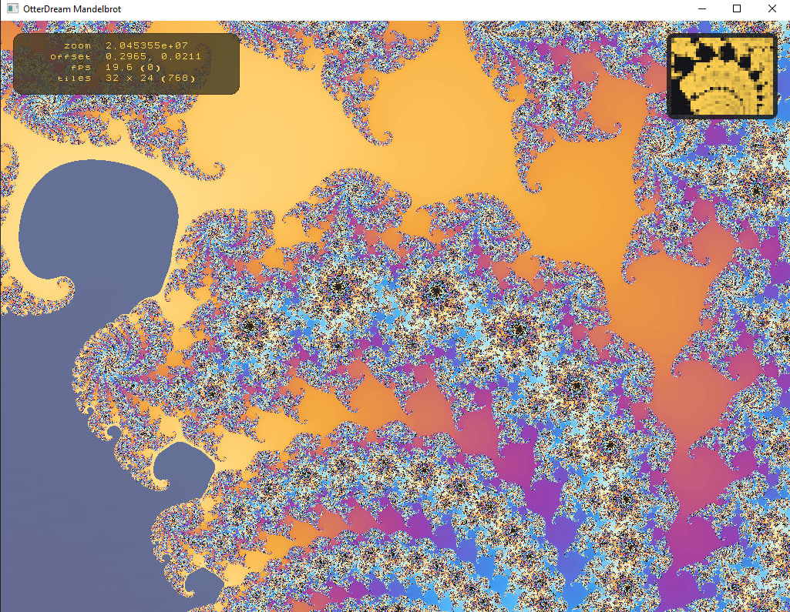

<!-- Datei: README.md -->

<!-- 🐭 Maus-Kommentar: README für Alpha 81 – CI-validiert, Silk-Lite Zoom integriert, Auto-Tuner statt JSON-Reload. Logs jetzt mit Epoch-Millis, strikt einzeilig. CUDA 13 ist Pflicht; GLEW dynamisch. Schneefuchs: „Nur was synchron ist, bleibt stabil.“ -->

# 🦦 OtterDream Mandelbrot Renderer (CUDA + OpenGL)

[](https://github.com/Funcry241/mandelbrot-fraktal-maus/actions/workflows/ci.yml)


[](LICENSE)

<p align="center">
  
</p>

Ein ultraschneller Mandelbrot-Renderer mit CUDA-Beschleunigung und OpenGL-Anzeige für moderne NVIDIA-GPUs. Der Renderer zoomt automatisch in interessante Regionen und erhöht fortlaufend die Detailtiefe.
Seit **Alpha 81**: CI-validiert, deterministisch, sanfter **Silk-Lite**-Zoom — und kompakte **Epoch-Millis**-Logs.

---

## 🧠 Features

* **🚀 CUDA Rendering**
  2-Pass Mandelbrot-Pipeline (Warmup + Sliced Finish), warp-synchron, CHUNKed (`WARP_CHUNK=64`).

  * **Survivor-Black**: unfertige Pixel sofort schwarz → *kein Ghosting* zwischen Slices.
  * **Event-Timing**: Ereignisbasierte Messung via CUDA-Events (ohne globales `cudaDeviceSynchronize()` im Normalpfad).

* **🎯 Auto-Zoom mit Entropie- und Kontrastanalyse**
  Softmax-Schwerpunkt über **Median/MAD**-normalisierte Scores; Softmax-Sparsification für ruhige Ziele.

* **🪶 Silk-Lite Motion Planner**
  Sanfte Schwenks, **Yaw-Rate-Limiter (rad/s)** + Längendämpfung, relative Hysterese & kurzer Lock gegen Flip-Flop.

* **🕳️ Anti-Black-Guard (Cardioid/Bulb-Avoidance)**
  Warm-up-Drift und **Void-Bias** schieben den Fokus verlässlich aus Innenbereichen → *kein „Zoom ins Schwarze“*.

* **📈 Progressive Iterationen (Zoom-abhängig)**
  Iterationszahl steigt automatisch mit dem Zoom-Level (Progressive/Resume optional).

* **🎨 Rüsselwarze-Farbmodus**
  Innen dunkel, außen strukturierte Chaoswellen (Smooth Coloring mit Streifen-Shading).

* **🔍 Adaptive Tile-Größe**
  Automatische Tile-Anpassung für bessere Detailauswertung bei starkem Zoom.

* **🖼️ Echtzeit-OpenGL + CUDA-Interop**
  Anzeige via Fullscreen-Quad, direkte PBO-Verbindung (`cudaGraphicsGLRegisterBuffer`).

* **📊 Heatmap-Overlay (Projekt Eule)**
  Visualisierung von Entropie/Kontrast pro Tile (GPU-Shader-Variante in Arbeit).

* **🧰 HUD & ASCII-Debug (Warzenschwein)**
  FPS, Zoom, Offset – optional. **Logging ist ASCII-only** und wirkt nicht auf Berechnungs-/Render-Pfade.

* **🤖 Auto-Tuner**
  Findet ohne Neustart zyklisch optimale Zoom-/Analyseparameter und schreibt sie ins Log (kein JSON-Reload nötig).

---

## 🆕 Neu in dieser Version (Alpha 81+)

* **Sliced Survivor Finish** mit **Survivor-Black** (ghosting-frei)
* **Event-Timing** per CUDA-Events (kostenarm & präzise)
* **Anti-Black-Guard** (Warm-up-Drift + Void-Bias gegen Cardioid/Bulb-Hänger)
* **Yaw-Limiter** (rad/s → rad/Frame via `dt`) + **Längendämpfung**
* **Hysterese/Lock & dyn. Retarget-Throttle** für ruhiges Zielhalten
* **Softmax-Sparsification** & robuste **Median/MAD**-Statistik
* **Epoch-Millis-Logging** (UTC-Millis seit 1970) — kompakt, sortier- & skriptfreundlich

---

## 🖥️ Systemvoraussetzungen

* Windows 10/11 **oder** Linux
* **NVIDIA GPU** mit CUDA (Compute Capability **8.0+**, empfohlen **8.6+**)
* **CUDA Toolkit v13.0+ (erforderlich)** – inkl. `nvcc`
* Visual Studio 2022 **oder** GCC 11+
* CMake (Version **≥ 3.28**), Ninja
* vcpkg (für GLFW, GLEW; **GLEW dynamisch**, kein `GLEW_STATIC`)

> ⚠️ GPUs unter Compute Capability 8.0 (z. B. Kepler, Maxwell) werden **nicht** unterstützt.  
> ⚠️ OpenGL **4.3 Core** wird vorausgesetzt.

---

## 📦 Abhängigkeiten (via vcpkg)

* [GLFW](https://www.glfw.org/) – Fenster-/Eingabe-Handling
* [GLEW](http://glew.sourceforge.net/) – OpenGL-Extension-Management (dynamisch)

---

## 🔧 Build-Anleitung

> **Hinweis:** Der Build läuft vollständig über **Standard-CMake** (host-agnostisch).
> Ein **optionales** PowerShell-Skript `build.ps1` ist enthalten, wird aber nicht benötigt.

### 1) Repository & vcpkg holen

```bash
git clone --recurse-submodules https://github.com/Funcry241/mandelbrot-fraktal-maus.git
cd mandelbrot-fraktal-maus
# vcpkg lokal bootstrappen (unter Windows .bat verwenden)
git clone https://github.com/microsoft/vcpkg.git
cd vcpkg
./bootstrap-vcpkg.sh   # Windows: .\bootstrap-vcpkg.bat
cd ..
```

### 2) Windows (MSVC + Ninja)

```powershell
cmake -S . -B build -G Ninja `
  -DCMAKE_TOOLCHAIN_FILE="${PWD}/vcpkg/scripts/buildsystems/vcpkg.cmake" `
  -DCMAKE_BUILD_TYPE=Release
cmake --build build --config Release
# (optional) Installationsbaum erzeugen
cmake --install build --prefix .\dist
# Ausführen
./build/mandelbrot_otterdream.exe
```

### 3) Linux (GCC + Ninja)

```bash
cmake -S . -B build -G Ninja   -DCMAKE_TOOLCHAIN_FILE="$PWD/vcpkg/scripts/buildsystems/vcpkg.cmake"   -DCMAKE_BUILD_TYPE=Release
cmake --build build --config Release
# (optional) Installationsbaum erzeugen
cmake --install build --prefix ./dist
# Ausführen
./build/mandelbrot_otterdream
```

> **Tipp:** Abweichende Compute Capability? Beim Konfigurieren überschreiben:
>
> ```bash
> cmake -S . -B build -G Ninja >   -DCMAKE_CUDA_ARCHITECTURES=90 >   -DCMAKE_TOOLCHAIN_FILE="$PWD/vcpkg/scripts/buildsystems/vcpkg.cmake" >   -DCMAKE_BUILD_TYPE=Release
> ```

---

### ⌨️ Keyboard Controls

* `P`: Auto-Zoom pausieren/fortsetzen
* `H`: Heatmap-Overlay ein/aus
* `T`: HUD (Warzenschwein) ein/aus
> Optional: `Space` kann zusätzlich als Alias für `P` gemappt werden.

---

## 🌊 Das Robbe-Prinzip (API-Synchronität)

**Seit Alpha 41 gilt:** Header und Source bleiben **synchron**. Kein Drift, kein API-Bruch. Die Robbe wacht.

> „API-Änderung ohne Header-Update? Dann OOU-OOU und Build-Fehler!“

---

## 🦝 Waschbär-Prinzip (Auto-Fix & Hygiene)

**Ab Alpha 53:** Der Build prüft auf bekannte Toolchain-Fallen (z. B. `glew32d.lib`) und hält CMake-Hygiene hoch — **ohne** projektexterne Skripte.

---

## 🔎 Qualitäts-Guards (Kurzüberblick)

* **Anti-Black-Guard**: Warm-up-Drift & Void-Bias – kein „Zoom ins Schwarze“
* **Survivor-Black**: Ghosting-freie Slices
* **Hysterese/Lock**: verhindert Ziel-Flip-Flops
* **Retarget-Throttle**: CPU-schonend, ruhiger Kurs
* **Softmax-Sparsification**: ignoriert irrelevante Tails

---

## 🧭 Zoomgerichtet & geschmacksgetestet

Silk-Lite koppelt **Analyse (Entropie/Kontrast)** und **Bewegung**:
Top-k-Tiles bilden per Softmax einen Schwerpunkt; der Motion-Planner fährt dorthin mit begrenzter Yaw-Rate, Dämpfung und kurzer Lock-Phase.
Ergebnis: zielstrebig, ruckfrei — ohne „ins Schwarze“ zu kippen.

---

## ⚙️ Konfigurationshinweise

* **Logging**: ASCII-only; strikt **einzeilig** pro Event. Zeitstempel sind **Epoch-Millis (UTC)**.
  `debugLogging` für Diagnose; `performanceLogging` misst budgetschonend via CUDA-Events.
* **ForceAlwaysZoom**: hält den Zoomfluss aktiv (mit weicher Drift, falls kein starkes Signal vorliegt).

---

## 📄 Lizenz

MIT-Lizenz – siehe [LICENSE](LICENSE).

---

**OtterDream** – von der Raupe zum Fraktal-Schmetterling 🦋
*Happy Zooming!*

🐭 Maus sorgt für Fokus und ASCII-Sauberkeit.  
🦊 Schneefuchs bewacht die Präzision.  
🦦 Otter treibt den Zoom unaufhaltsam.  
🦭 Robbe schützt die API-Würde.  
🦝 Waschbär hält den Build hygienisch.  
🦉 Eule sorgt für Überblick in Heatmap & Koordinaten.
