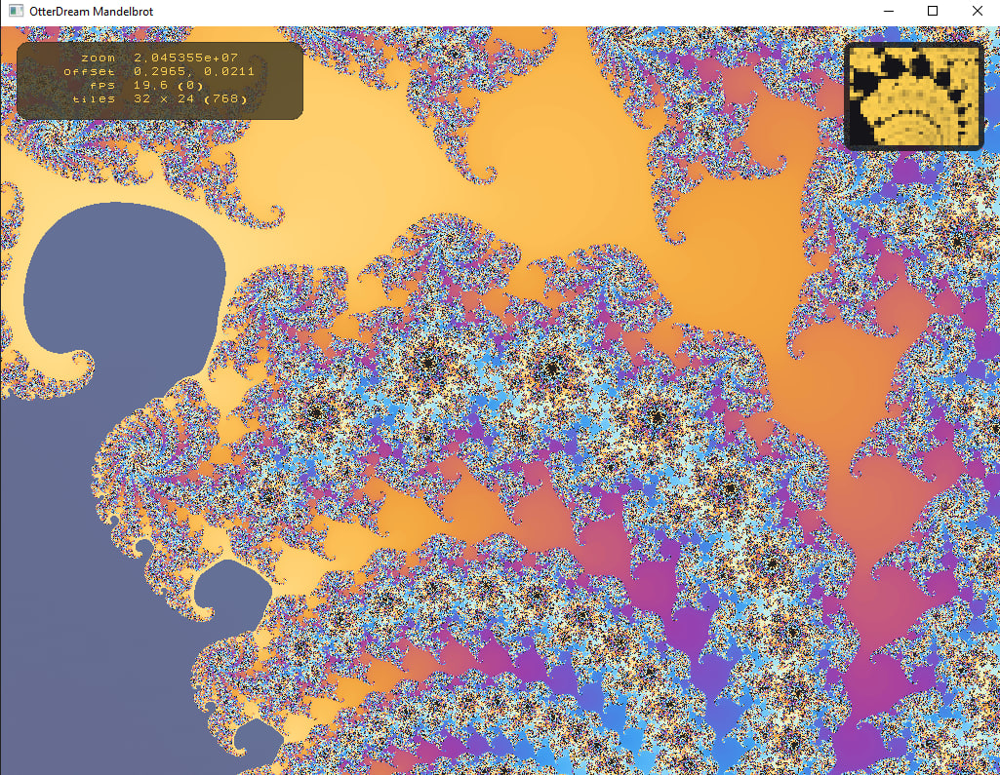

<!-- Otter: README für OtterDream (Alpha 81+), Einstieg & Build-Anleitung. -->
<!-- Schneefuchs: Muss mit ci.yml, AGENTS.md und CMakeLists.txt übereinstimmen. -->
<!-- Maus: Fokus auf reproduzierbaren Build (Windows & Ubuntu 22.04, CUDA 13). -->
<!-- Datei: README.md -->

# 🦦 OtterDream Mandelbrot Renderer (CUDA + OpenGL)

[](https://github.com/Funcry241/mandelbrot-fraktal-maus/actions/workflows/ci.yml)


[](LICENSE)

<p align="center">
  
</p>

Ein ultraschneller Mandelbrot-Renderer mit CUDA-Beschleunigung und OpenGL-Anzeige für moderne NVIDIA-GPUs. Der Renderer zoomt automatisch in interessante Regionen und erhöht fortlaufend die Detailtiefe.
Seit **Alpha 81**: CI-validiert, deterministisch, sanfter **Silk-Lite**-Zoom - **Nacktmull**-Perf-Kadenz - und kompakte **Epoch-Millis**-Logs.

> **Neu (Phase-1 „Replikatoren sichtbar“)**  
> - **Orbit/Perturb-Gate: _ON_** (Ctrl+P toggelt zur Laufzeit).  
> - **AOP Policy (Dry-Run): _ON_** - zeigt Zielvorschau als **[REPL/POLICY]**-Zeilen; keine Steuerwirkung.  
> - **Luchs-Logging: _ON_** - ASCII-only, Host/Device getrennt.

---

## 🧾 Bären-Checkliste (vor dem Build)

**Nur ausführen (Windows, dist\):**

- Aktueller **NVIDIA-Grafiktreiber** installiert.
- GPU unterstützt **OpenGL 4.3 Core** (RTX/GTX der letzten Generationen).
- Im Repo existiert ein `dist\`-Ordner mit `mandelbrot_otterdream.exe`.

**Bauen (Windows oder Linux):**

- NVIDIA-GPU mit CUDA-Unterstützung (**Compute Capability ≥ 8.0**, empfohlen **8.6+**).
- **CUDA Toolkit 13.0+** ist installiert, `nvcc --version` funktioniert.
- **CMake ≥ 3.28**, **Ninja**, **vcpkg** sind installiert bzw. lokal im Repo vorhanden.
- Unter **Windows**: Visual Studio 2022 mit „Desktop development with C++“.
- Unter **Linux**: GCC 11+, X-/OpenGL-Dev-Pakete (siehe Abschnitt „Linux (GCC + Ninja)“).

Wenn diese Häkchen gesetzt sind, kann ein Bär OtterDream mit den untenstehenden Befehlen kompilieren und starten.

---

## ✨ Sofort testen (Windows, **ohne Setup**)

**Wenn du nur schnell schauen willst, nimm einfach `dist\mandelbrot_otterdream.exe` und starte sie – du musst nichts bauen.**

Wenn du das Projekt **nur ausprobieren** möchtest, brauchst du **nichts zu installieren**.  
Im Repository/Arbeitsverzeichnis liegt ein **`dist\`**-Ordner mit einer **portablen Windows-Build**:

```
dist\
  mandelbrot_otterdream.exe   ← doppelklicken & starten
  glew32.dll                  ← bereits mitgeliefert
  glfw3.dll                   ← bereits mitgeliefert
  cudart64_130.dll            ← falls erforderlich, bereits mitgeliefert
```

**Voraussetzung zum Ausführen:** Ein aktueller **NVIDIA-Grafiktreiber** und OpenGL 4.3.  
**Nicht nötig zum Ausführen:** Visual Studio, vcpkg oder das CUDA Toolkit (Runtime-DLLs liegen bei).

> Falls `dist\mandelbrot_otterdream.exe` fehlt: einmal bauen (siehe „⚡ Windows-Schnellstart“ oder „Automatischer Build“) – der Build füllt `dist\` automatisch.

---

## ⚡ Windows-Schnellstart (in 5 Befehlen)

Für einen typischen Windows-Entwickler mit Visual Studio 2022, CUDA 13 und Git:

```powershell
git clone --recurse-submodules https://github.com/Funcry241/mandelbrot-fraktal-maus.git
cd mandelbrot-fraktal-maus
powershell -ExecutionPolicy Bypass -File .uild.ps1
cd .\dist
.\mandelbrot_otterdream.exe
```

Wenn einer der Befehle scheitert (z. B. `build.ps1`), bitte die ausführlichen Abschnitte zu **„Automatischer Build (Windows)“** und **„Manueller Build (CMake)“** weiter unten lesen.

---

## 🔧 Automatischer Build (Windows) – `build.ps1`

**Voraussetzungen (für den Build):**

- Windows 10/11 x64  
- NVIDIA-GPU mit Compute Capability **8.0+** (empfohlen **8.6+**)  
- Visual Studio 2022 mit „Desktop development with C++“  
- **CUDA Toolkit 13.0+** (inkl. `nvcc`; prüfen mit `nvcc --version`)  
- PowerShell 5.1 (Standard bei Windows 10/11)  
- Aktueller NVIDIA-Grafiktreiber (für CUDA/OpenGL)

Der einfachste Weg, den Build zu starten, ist das **PowerShell-Skript** `build.ps1`.  
Es orchestriert alles: vcpkg-Abhängigkeiten, CMake-Konfiguration/Build, und das **Befüllen von `dist\`** (EXE + benötigte DLLs).

```powershell
# Aus dem Repo-Root
powershell -ExecutionPolicy Bypass -File .uild.ps1
# Optional: Konfiguration wählen (Default: RelWithDebInfo)
powershell -ExecutionPolicy Bypass -File .uild.ps1 -Configuration Release
```

**Was `build.ps1` für dich erledigt**

- Öffnet die passende **VS-Entwicklungsumgebung**, konfiguriert **CMake + Ninja**
- Installiert/prüft **GLFW** & **GLEW** via **vcpkg** (**dynamisch**)
- Baut das Projekt und kopiert **EXE + DLLs nach `dist\`**
- Zeigt Live-Progress (Spinner, %, ETA) über den **Rust-Runner**

> Du brauchst lediglich PowerShell 5.1, Visual Studio 2022 Build-Tools und das **CUDA Toolkit 13** (nur zum **Bauen**; zum **Ausführen** nicht nötig).

---

## 🔧 Manueller Build (CMake)

> Der Build läuft vollständig über **Standard-CMake** (host-agnostisch). `build.ps1` ist nur Komfort.  
> Voraussetzung ist immer ein installiertes **CUDA Toolkit 13.0+** und ein funktionierendes `nvcc` (siehe unten).

### 1) Repository & vcpkg holen

```bash
git clone --recurse-submodules https://github.com/Funcry241/mandelbrot-fraktal-maus.git
cd mandelbrot-fraktal-maus
# vcpkg lokal bootstrappen (unter Windows .bat verwenden)
git clone https://github.com/microsoft/vcpkg.git
cd vcpkg
./bootstrap-vcpkg.sh            # Linux/macOS
bootstrap-vcpkg.bat             # Windows (PowerShell oder CMD)
cd ..
```

### 2) Windows (MSVC + Ninja)

Bitte in einer **Developer PowerShell / Developer CMD** von Visual Studio 2022 oder nach Aufruf von `vsdevcmd.bat` ausführen, damit MSVC und `ninja` im Pfad sind.

```powershell
cmake -S . -B build -G Ninja `
  -DCMAKE_TOOLCHAIN_FILE="${PWD}/vcpkg/scripts/buildsystems/vcpkg.cmake" `
  -DCMAKE_BUILD_TYPE=Release
cmake --build build --config Release
# Installationsbaum erzeugen (optional)
cmake --install build --prefix .\dist
# Starten
.\dist\mandelbrot_otterdream.exe
```

### 3) Linux (GCC + Ninja, Ubuntu 22.04-Referenz)

**1) Systempakete installieren**

```bash
sudo apt-get update
sudo apt-get install -y ninja-build git cmake     xorg-dev libxinerama-dev libxcursor-dev libxi-dev libxmu-dev     mesa-common-dev libgl1-mesa-dev pkg-config
```

**2) NVIDIA-Treiber + CUDA Toolkit 13.0 installieren**

Bitte die offizielle NVIDIA-Anleitung für Ubuntu 22.04 verwenden.  
Nach der Installation:

```bash
nvcc --version   # muss CUDA 13.x melden
nvidia-smi       # GPU sichtbar
```

**3) CMake-Konfiguration und Build**

```bash
cmake -S . -B build -G Ninja   -DCMAKE_TOOLCHAIN_FILE="$PWD/vcpkg/scripts/buildsystems/vcpkg.cmake"   -DCMAKE_BUILD_TYPE=Release   -DCMAKE_CUDA_COMPILER="$(which nvcc)"
cmake --build build --config Release
cmake --install build --prefix ./dist
./dist/mandelbrot_otterdream
```

> **Tipp:** Compute Capability beim Konfigurieren überschreiben:
>
> ```bash
> cmake -S . -B build -G Ninja >   -DCMAKE_CUDA_ARCHITECTURES=90 >   -DCMAKE_TOOLCHAIN_FILE="$PWD/vcpkg/scripts/buildsystems/vcpkg.cmake" >   -DCMAKE_BUILD_TYPE=Release >   -DCMAKE_CUDA_COMPILER="$(which nvcc)"
> ```

---

## 🧠 Features

* **🚀 CUDA Rendering (Capybara)** – schnelle Iterationen, Event-Timing via CUDA-Events (keine globale `cudaDeviceSynchronize()` im Hot-Path).
* **🪶 Silk-Lite Motion Planner (Auto-Zoom)** – sanft, yaw-limitiert, Hysterese/Lock; **ForceAlwaysZoom=ON**.
* **🛡️ Anti-Black-Guard** – Warm-up-Drift + Void-Bias: kein „Zoom ins Schwarze“.
* **📈 Progressive Iterationen** – Zoom-abhängig; **standardmäßig aktiv**.
* **🎨 GT-Palette + Smooth Coloring** – linearer Farbraum, `it - log2(log2(|z|))`; Stripes optional (off).
* **🖼️ Echtzeit-OpenGL + CUDA-Interop** – PBO-Interop (`cudaGraphicsGLRegisterBuffer`).
* **📊 Heatmap-Overlay (Eule)** – GPU-Shader; **Metrics-Kadenz** über `Settings::StatsCadence::heatmapEveryN` (Default **3**).
* **🤖 AOP Policy (Dry-Run)** – **[REPL/POLICY]**-Zeilen mit Ziel-Tile/Score/NDC-Marker; **keine Steuerwirkung**.
* **🌪️ Orbit/Perturb-Gate** – sichtbar **ON** (Ctrl+P Runtime-Toggle); Gategröße `Settings::Perturb::gatePixelSize`.
* **🧰 HUD & ASCII-Debug (Warzenschwein)** – FPS/Zoom/Offset; Logs sind **ASCII-only**.
* **🦔 Nacktmull-Perf-Kadenz** – `[PERF]`-Zeile pro Cadence, **stale-carry** von `e0/c0` + `hmAge`-Marker.

---

## ⚙️ Settings (relevante Schalter)

```cpp
// Logging cadence
Settings::PerfLog::enabled       = true;
Settings::PerfLog::warmupFrames  = 0;
Settings::PerfLog::everyN        = 1;   // 1 = jede Frame
// Metrics cadence
Settings::StatsCadence::heatmapEveryN = 3; // 0→1→2→0 Muster; hmAge spiegelt das
// Replikatoren
Settings::Perturb::enabled = true; // Ctrl+P toggelt zur Laufzeit
Settings::Ai::enabled      = true; // AOP Dry-Run aktiv
Settings::Luchs::enabled   = true; // Host/Device ASCII-Logs
```

---

## 🧪 Logging-Formate (Kern)

**Eine feste ASCII-Zeile pro Cadence:**

```
[<epoch-ms>][cuda_interop.cu][line]: [PERF] capy=<ms> col=<ms> b=<budget-ms> ema=<x.xxx> bh=<0/1>
```

**Legende (Kurz):** `capy` Render via Capybara, `col` Colorizer, `b` Budget, `ema` geglättete Budget-Auslastung, `bh` Budget-Hit (1 = Budget erschöpft).

> EC-spezifische Metriken sind derzeit **entfernt**.

**Policy-Preview:**

```
[REPL/POLICY] dry-run tiles=<Tx×Ty> statsPx=<px> best=<i> score=<s> ndc=(x,y)
```

---

## 🖥️ Systemvoraussetzungen

* Windows 10/11 **oder** Linux (Referenz: Ubuntu 22.04 x86_64)  
* **NVIDIA GPU** mit CUDA (Compute Capability **8.0+**, empfohlen **8.6+**)  
* **Für den Build (Windows + Linux):**  
  * CUDA Toolkit **v13.0+** (inkl. `nvcc`)  
  * Visual Studio 2022 (Windows) bzw. GCC 11+ (Linux)  
  * CMake ≥ 3.28, Ninja, vcpkg  
  * Unter Linux zusätzlich: X-/OpenGL-Dev-Pakete (siehe Abschnitt „Linux (GCC + Ninja)“)  
* **Für das Ausführen (nur Windows, via `dist\`):** **nur NVIDIA-Treiber** (OpenGL 4.3 Core), die Runtime-DLLs liegen bei.

> ⚠️ GPUs unter Compute Capability 8.0 (z. B. Kepler/Maxwell) werden **nicht** unterstützt.  
> ⚠️ Generische Container/Code-Runner ohne CUDA Toolkit/`nvcc` können OtterDream **nicht** kompilieren; das ist erwartetes Verhalten.

---

## 📦 Abhängigkeiten (via vcpkg)

* [GLFW](https://www.glfw.org/) – Fenster/Eingabe  
* [GLEW](http://glew.sourceforge.net/) – OpenGL-Extensions (**dynamisch**, DLL im `dist\`)

---

### ⌨️ Keyboard Controls

* `P` – Auto-Zoom pausieren/fortsetzen  
* `H` – Heatmap-Overlay an/aus  
* `T` – HUD (Warzenschwein) an/aus  
* `Ctrl+P` – **Perturb-Gate** toggeln (nur sichtbar in Logs/Overlays)

---

## 🌊 Das Robbe-Prinzip (API-Synchronität)

Header und Source bleiben **synchron**. Kein Drift, kein API-Bruch. Die Robbe wacht.

**Referenz-Signaturen (Auszug):**
* `src/cuda_interop.hpp` -> **`renderCudaFrame(...)`**
* `src/capybara_frame_pipeline.cuh` -> **`capy_render(...)`**

---

## 🌐 CI/CD

**GitHub Actions**: Configure → Build (Ninja) → Install → Artefakt `dist/`.  
**Checks:** CUDA-Kompilierung, Presets konsistent, deterministische Artefakte.

**Dependabot**: PRs für `vcpkg.json` (wöchentlich), CI baut/verifiziert.

---

## ❓ Troubleshooting (Kurz)

* **`nvcc` fehlt** → **CUDA 13** installieren, PATH/INCLUDE/LIB prüfen (`nvcc --version`)  
* **GLEW-Mismatch** (z. B. `glew32d.lib`) → **dynamisches GLEW** sicherstellen und Triplet/Cache prüfen  
* **Schwarze Frames** bei extremem Pan/Zoom → Silk-Lite/Anti-Black-Guard aktiv lassen; Messläufe ohne Debug-Logs  
* **CUDA-Interop Stalls** → PBO-Ring (≥3), `WriteDiscard`, persistentes Mapping, Fences  

> **Wenn der Build trotz erfüllter Checkliste nicht klappt: Das ist kein persönliches Versagen. CUDA-Toolchains sind zickig – atme kurz durch, lies die Fehlermeldung in Ruhe und hake sie Schritt für Schritt mit der README ab (oder häng ein Issue mit Log an).**

---

**OtterDream** – von der Raupe zum Fraktal-Schmetterling 🦋  
*Happy Zooming!*

🐭 Maus sorgt für Fokus und ASCII-Sauberkeit.  
🦊 Schneefuchs bewacht die Präzision.  
🦦 Otter treibt den Zoom unaufhaltsam.  
🦭 Robbe schützt die API-Würde.
